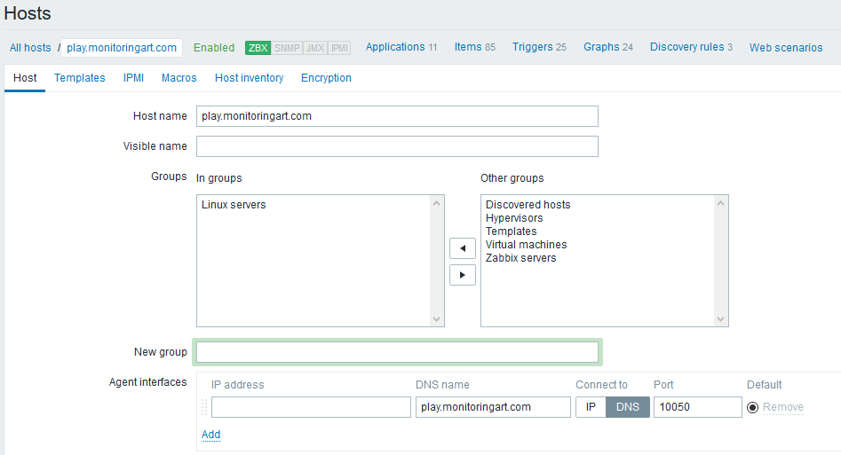
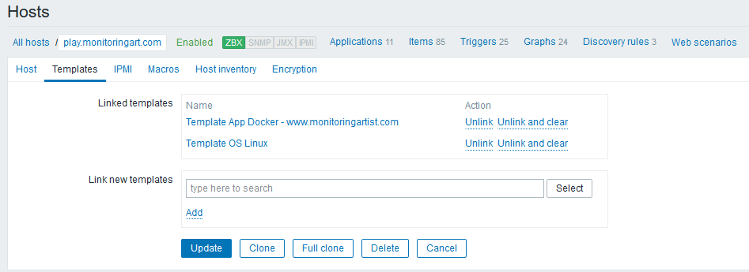
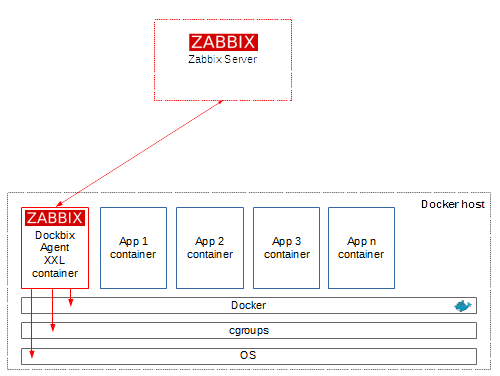

# Dockbix Agent XXL - Zabbix Agent with Docker monitoring

[](https://img.shields.io/docker/pulls/monitoringartist/dockbix-agent-xxl-limited.svg)
[](https://github.com/monitoringartist/dockbix-agent-xxl)
[](https://img.shields.io/docker/pulls/monitoringartist/dockbix-agent-xxl-limited.svg)
[](https://hub.docker.com/r/monitoringartist/dockbix-agent-xxl-limited/)
[](http://www.monitoringartist.com 'DevOps / Docker / Kubernetes / AWS ECS / Google GCP / Zabbix / Zenoss / Terraform / Monitoring')

Standard Zabbix Agent with Docker and host metrics support, which can be used
with any Zabbix server. Tested on CoreOS, RHEL, CentOS, Ubuntu, Debian, Fedora,
Boot2docker, Photon OS.

If you like or use this project, please provide feedback to author - Star it ★
or [submit feedback form](https://docs.google.com/forms/d/e/1FAIpQLSdte1irviwtQzXU8_DMzboxf_qggE3qgjgpPHoBlE9RzLCXKA/viewform).

**Overview of Monitoring Artist (dockerized) monitoring ecosystem:**

- **[Zabbix XXL](https://hub.docker.com/r/monitoringartist/zabbix-xxl/)** - standard Zabbix server/proxy/UI/snmpd/java gateway with additional XXL extensions
- **[Dockbix agent XXL](https://hub.docker.com/r/monitoringartist/dockbix-agent-xxl-limited/)** - Zabbix agent with [Docker (Kubernetes/Mesos/Chronos/Marathon) monitoring](https://github.com/monitoringartist/zabbix-docker-monitoring)
- **[Zabbix templates](https://hub.docker.com/r/monitoringartist/zabbix-templates/)** - tiny (5MB) image for easy template deployment of selected Zabbix monitoring templates
- **[Zabbix extension - all templates](https://hub.docker.com/r/monitoringartist/zabbix-ext-all-templates/)** - storage image for Zabbix XXL with 200+ [community templates](https://github.com/monitoringartist/zabbix-community-repos)
- **[Kubernetized Zabbix](https://github.com/monitoringartist/kubernetes-zabbix)** - containerized Zabbix cluster based on Kubernetes
- **[Grafana XXL](https://hub.docker.com/r/monitoringartist/grafana-xxl/)** - dockerized Grafana with all community plugins
- **[Grafana dashboards](https://grafana.net/monitoringartist)** - Grafana dashboard collection for [AWS](https://github.com/monitoringartist/grafana-aws-cloudwatch-dashboards) and [Zabbix](https://github.com/monitoringartist/grafana-zabbix-dashboards)
- **[Monitoring Analytics](https://hub.docker.com/r/monitoringartist/monitoring-analytics/)** - R statistical computing and graphics for monitoring from data scientists
- **[Docker killer](https://hub.docker.com/r/monitoringartist/docker-killer/)** - Docker image for Docker stress and Docker orchestration testing

Start Dockbix agent container and monitor all Docker containers on your host.
Module [Zabbix Docker monitoring](https://github.com/monitoringartist/zabbix-docker-monitoring)
is used - all [docker module container metrics](https://github.com/monitoringartist/zabbix-docker-monitoring)
are available except `docker.xnet`. Import/assign [Docker template](https://raw.githubusercontent.com/monitoringartist/zabbix-docker-monitoring/master/template/Zabbix-Template-App-Docker.xml) +
official Zabbix "Template OS Linux" and then just start Dockbix agent container:

```
docker run \
  --name=dockbix-agent-xxl \
  --net=host \
  --privileged \
  -v /:/rootfs \
  -v /var/run:/var/run \
  -e "ZA_Server=<ZABBIX SERVER IP/DNS NAME>" \
  -d monitoringartist/dockbix-agent-xxl-limited:latest
```

Please donate to the author, so he can continue to publish other awesome projects
for free:

[](https://www.paypal.com/cgi-bin/webscr?cmd=_s-xclick&hosted_button_id=8LB6J222WRUZ4)

# Public limited vs private paid image

[Buy](https://monitoringartist.com/product/private-docker-image-dockbix-agent-xxl/)

Public limited Docker image `monitoringartist/dockbix-agent-xxl-limited:latest`
has almost the same functionality as private paid Docker image
`monitoringartist/dockbix-agent-xxl:latest`. However, limited version:

- doesn't support command execution in the container; for example, you can't
use `system.run[]` item
- doesn't support any shell access in the container; for example, you can't
use `docker exec -ti dockbix-agent-xxl bash`
- collects statistic Google Analytics data (Docker version, kernel version, execution driver,
Dockbix agent container start-up errors, ...), which are used for improvements;
statistics may be used also for public presentations

General limitations:

- Zabbix agent TLS support and Zabbix agent server IP check are disabled

# Environment configuration variables

You can use almost any [agent config parameter](https://www.zabbix.com/documentation/3.2/manual/appendix/config/zabbix_agentd),
just add prefix `ZA_`. If you don't specify a custom setting variable, then default
Zabbix agent setting will be used. For example, you want to use `StartAgents=10`,
just add environment variable `-e "ZA_StartAgents=10"`.

Example:

```
docker run \
  --name=dockbix-agent-xxl \
  --net=host \
  --privileged \
  -v /:/rootfs \
  -e "ZA_Server=<ZABBIX SERVER IP/DNS NAME>" \
  -e "ZA_ServerActive=<ZABBIX SERVER IP/DNS NAME>" \
  -e "ZA_StartAgents=10" \
  -e "ZA_Timeout=30" \
  -d monitoringartist/dockbix-agent-xxl-limited:latest
```

You can't override some parameters: `AllowRoot, LoadModulePath, LoadModule,
LogType`, because Docker monitoring module is used. Also Zabbix agent configuration
from the config file is not supported.

# Public Dockbix agent XXL

Public Dockbix agent XXL is available on the address
`play.monitoringart.com:10050`. It's available for anyone as a public part of
monitoringartist playground. Just create new host in your Zabbix server with
this configuration:





# How it works



No classic rpm/deb package installation or Zabbix module compilation. Just start
dockbix-agent-xxl container and Docker container metrics will be collected from
the Docker daemon API or cgroups.

# How to monitor dockerized apps

Ideas about monitoring of dockerized apps:

- health endpoint: publish app health as a http endpoint, which can be used for
  monitoring (item keys: `web.page.get, web.page.regexp`)
- monitor them as a service: use standard Zabbix TCP/HTTP check
  (item keys: `net.tcp.port, net.tcp.service, net.tcp.service.perf`)
- monitor them as a process: use standard Zabbix process check
  (item key: `proc.num`)

Still no idea how to monitor yours dockerized app? [Hire us!](#author)

# Included projects

 * [zabbix_agent_bench](https://github.com/cavaliercoder/zabbix_agent_bench) -
 utility to test performance of Zabbix agent
 * [zabbix-server-stress-test](https://github.com/monitoringartist/zabbix-server-stress-test) -
 loadbable agent module for stress testing

Zabbix agent stress testing:

```
docker run \
  --name=dockbix-agent-xxl \
  --net=host \
  --privileged \
  -v /:/rootfs \
  -v /var/run:/var/run \
  -e "ZA_Server=<ZABBIX SERVER IP/DNS NAME>" \
  -d monitoringartist/dockbix-agent-xxl-limited:latest

# used HW - 8xCPU Intel(R) Xeon(R) CPU E31270 @ 3.40GHz:
docker exec -ti dockbix-agent-xxl zabbix_agent_bench -timelimit 30 -key stress.ping --threads 50
Testing 1 keys with 50 threads (press Ctrl-C to cancel)...
stress.ping :	1225787	0	0

=== Totals ===

Total values processed:		1225787
Total unsupported values:	0
Total transport errors:		0
Total key list iterations:	1225787

Finished! Processed 1225787 values across 50 threads in 30.002141605s (40856.650040 NVPS)
```

# Integrations

* [Puppet for dockbix-agent-xxl-limited](puppet.md)
* [Ansible for dockbix-agent-xxl-limited](ansible.md)
* [docker-compose for dockbix-agent-xxl-limited](docker-compose.yml)
* [systemd service unit file - see next section](#dockbix-agent-xxl-service-managed-by-systemd)

# Dockbix Agent XXL service managed by systemd

Example of [systemd service unit file for Dockbix Agent XXL](systemd/docker-dockbix-agent-xxl.service) -
don't forget to edit environment variables. Then you can manage Dockbix agent XXL
as a standard OS service:

```
# wget -P /usr/lib/systemd/system/ https://raw.githubusercontent.com/monitoringartist/dockbix-agent-xxl/master/systemd/docker-dockbix-agent-xxl.service
## edit env variables: vi /usr/lib/systemd/system/docker-dockbix-agent-xxl.service
# systemctl enable docker-dockbix-agent-xxl.service
Created symlink from /etc/systemd/system/multi-user.target.wants/docker-dockbix-agent-xxl.service to /usr/lib/systemd/system/docker-dockbix-agent-xxl.service.
# systemctl start docker-dockbix-agent-xxl.service
# systemctl status docker-dockbix-agent-xxl.service
● docker-dockbix-agent-xxl.service - Dockbix Agent XXL www.monitoringartist.com
   Loaded: loaded (/usr/lib/systemd/system/docker-dockbix-agent-xxl.service; enabled; vendor preset: disabled)
   Active: active (running) since Sat 2016-08-20 00:17:04 BST; 5s ago
  Process: 72712 ExecStartPre=/usr/bin/docker pull monitoringartist/dockbix-agent-xxl-limited:latest (code=exited, status=0/SUCCESS)
 Main PID: 72719 (docker)
   Memory: 8.6M
   CGroup: /system.slice/docker-dockbix-agent-xxl.service
           └─72719 /usr/bin/docker run --rm -e ZA_Server=<ZABBIX SERVER IP/DNS NAME> --name docker-dockbix-agent-xxl.service -h dockerhost --net=host --privileged -v /:/rootfs...

Aug 20 00:17:05 dockerhost docker[72719]: 11:20160819:231705.575 IPv6 support:          YES
Aug 20 00:17:05 dockerhost docker[72719]: 11:20160819:231705.575 TLS support:           YES
Aug 20 00:17:05 dockerhost docker[72719]: 11:20160819:231705.575 **************************
Aug 20 00:17:05 dockerhost docker[72719]: 11:20160819:231705.575 using configuration file: /etc/zabbix/zabbix_agentd.conf
Aug 20 00:17:05 dockerhost docker[72719]: 11:20160819:231705.581 loaded modules: zabbix_module_docker.so, zabbix_module_stress.so
Aug 20 00:17:05 dockerhost docker[72719]: 11:20160819:231705.583 agent #0 started [main process]
Aug 20 00:17:05 dockerhost docker[72719]: 12:20160819:231705.583 agent #1 started [collector]
Aug 20 00:17:05 dockerhost docker[72719]: 14:20160819:231705.583 agent #3 started [listener #2]
Aug 20 00:17:05 dockerhost docker[72719]: 13:20160819:231705.584 agent #2 started [listener #1]
Aug 20 00:17:05 dockerhost docker[72719]: 15:20160819:231705.586 agent #4 started [listener #3]
# docker ps | grep dockbix-agent-xxl
b2ecbf3a7df0        monitoringartist/dockbix-agent-xxl-limited:latest   "/dockbix-agent-xxl"       25 seconds ago      Up 24 seconds       0.0.0.0:10050->10050/tcp   docker-zabbix-agent-xxl.service
```

# Support

First try to troubleshoot problems yourself. Increase debug level ` -e 'ZA_DebugLevel=5'`
and check the container logs `docker logs dockbix-agent-xxl`.

Other options:

- Try to ask Zabbix community http://www.zabbix.org/wiki/Getting_help
- If you need support directly from the author, then don't hesitate to contact
him and ask for paid support

All reported issues, which are not really issues, but requests for support will
be closed with reference to this README section.

# Known issues

- a systems with recent kernel (4.8.4 and above) might have a problem
to start Dockbix agent properly (issue in the docker logs: `terminated with signal 11`)

# Author

[Devops Monitoring Expert](http://www.jangaraj.com 'DevOps / Docker / Kubernetes / AWS ECS / Google GCP / Zabbix / Zenoss / Terraform / Monitoring'),
who loves monitoring systems and cutting/bleeding edge technologies: Docker,
Kubernetes, ECS, AWS, Google GCP, Terraform, Lambda, Zabbix, Grafana, Elasticsearch,
Kibana, Prometheus, Sysdig, ...

Summary:
* 1000+ [GitHub](https://github.com/monitoringartist/) stars
* 6000+ [Grafana dashboard](https://grafana.net/monitoringartist) downloads
* 800 000+ [Docker image](https://hub.docker.com/u/monitoringartist/) pulls

Professional devops / monitoring / consulting services:

[](http://www.monitoringartist.com 'DevOps / Docker / Kubernetes / AWS ECS / Google GCP / Zabbix / Zenoss / Terraform / Monitoring')
